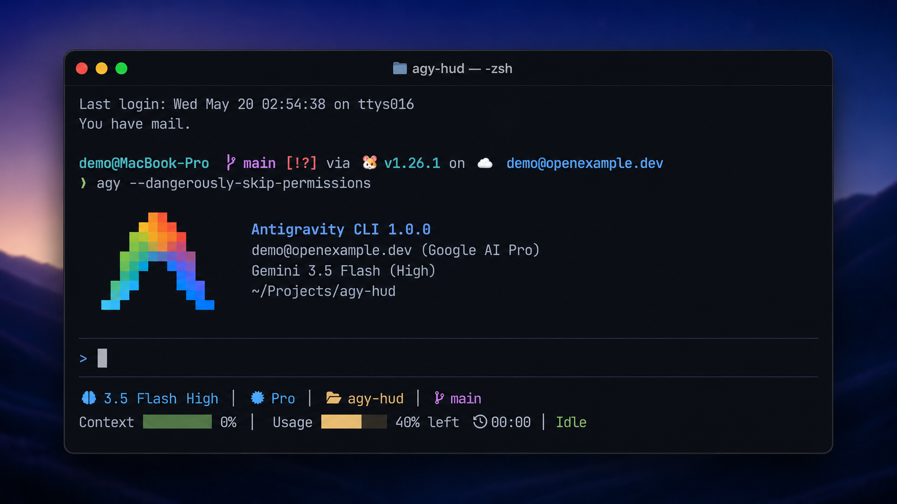

# agy-hud: Antigravity CLI Status-Line HUD Plugin

**English** | [简体中文](README.zh-CN.md)

`agy-hud` is a compact Antigravity CLI status-line HUD plugin written in TypeScript for Node.js.

It reads Antigravity status-line JSON from stdin and renders a short terminal HUD:



## Requirements

- Antigravity CLI with plugin support
- Node.js 18+ available on `PATH`

`agy-hud` is distributed as an Antigravity plugin archive, not as an npm package. The archive includes the bundled runtime script at `dist/agy-hud.js`, so plugin users do not need to run `npm install`.

## Install From GitHub Release

Download the platform-independent archive from the [latest release](https://github.com/franksde/agy-hud/releases/latest):

```sh
curl -fsSL -o agy-hud.tar.gz \
  https://github.com/franksde/agy-hud/releases/latest/download/agy-hud.tar.gz
tar -xzf agy-hud.tar.gz
agy plugin install ./agy-hud
```

The extracted directory is a complete plugin (`plugin.json`, `hooks/`, `dist/`), so it can be passed straight to `agy plugin install`. It runs with Node.js 18+ and does not require `npm install` after extraction.

## Install From Local Path

The repository includes the bundled runtime script at `dist/agy-hud.js`, so a fresh clone can be installed directly:

```sh
agy plugin validate <path-to-agy-hud>
agy plugin install <path-to-agy-hud>
```

If you edit the TypeScript sources, rebuild the bundle before installing:

```sh
npm ci
npm run build
npm test
```

## For AI Agents

If you are an AI agent installing `agy-hud` for someone, do not install silently. Confirm the look first.

1. Send the user this preview of a fully-populated HUD so they see every element before anything is installed:

   ```
    3.5 Flash High |  Pro │  agy-hud │  main
   Context █░░░░░░░ 12% (130k/1M) │ Usage █████░░░ 40% left  05:33 │ Thinking
   ```

   Tell them what they are looking at: model and plan tier, working directory, git branch, a context bar with token detail (`context_value: both`), quota usage with reset countdown, and agent state. The default config shows a more compact `percent` context. Icons need a Nerd Font — without one they render as boxes — and the HUD degrades cleanly on narrow terminals.

2. Ask the user to confirm the effect, or whether they want to adjust `multiline`, `show_icons`, `context_value`, or `usage_value` (see [Config](#config)).

3. After the user confirms, download `https://github.com/franksde/agy-hud/releases/latest/download/agy-hud.tar.gz`, then extract it.

4. Run `agy plugin install <extracted-dir>`. If it fails, show the user the error instead of retrying silently.

## Expected Release Install Shape

GitHub releases are expected to publish one platform-independent archive:

- `agy-hud.tar.gz`

The archive should contain `plugin.json`, `hooks/status-line.sh`, `dist/agy-hud.js`, `config.example.json`, `README.md`, `README.zh-CN.md`, `LICENSE`, and supporting docs.

## CLI

```sh
agy-hud statusline < statusline_payload.json
agy-hud version
agy-hud quota refresh
```

`statusline` renders from stdin plus local config/cache files. If the quota cache is missing or older than five minutes, it may start a detached background `quota refresh`, but foreground HUD rendering does not wait on network or subprocess work. `quota refresh` asks the running Antigravity local server for `GetUserStatus`, writes the sanitized quota cache, and exits non-zero if no local server can be reached.

## Config

`agy-hud` looks for config in:

- `AGY_HUD_CONFIG`
- `AGY_HUD_GIT_BRANCH` for an explicit git branch display override
- `config.json` next to the bundled script or plugin root
- `$XDG_CONFIG_HOME/agy-hud/config.json`
- `$HOME/.config/agy-hud/config.json`

Default config:

```json
{
  "show_model": true,
  "show_progress_bar": true,
  "multiline": true,
  "color": true,
  "debug": false,
  "show_git_branch": true,
  "show_cwd": true,
  "show_agent_state": true,
  "show_icons": true,
  "context_value": "percent",
  "usage_value": "remaining"
}
```

`show_progress_bar` and `multiline` default to `true`, matching the preferred compact two-line HUD. `debug` defaults to `false`; keep it disabled for normal use so status-line output stays clean. `AGY_HUD_GIT_BRANCH` is intended for environments where Antigravity does not provide a branch and the hook process cannot resolve one from the workspace.

Display options:

- `show_agent_state`: shows stdin `agent_state` such as `Idle`, `Thinking`, or `Auth`.
- `show_icons`: shows Nerd Font icons. Set to `false` to fall back to plain text if your terminal font renders boxes.
- `context_value`: `percent`, `tokens`, or `both`. Default is `percent`, so context shows current window occupancy.
- `usage_value`: `remaining` or `percent`. Default is `remaining`, so quota text shows what is left while the bar shows usage, for example `Usage █████░░░ 40% left  05:33`.

## Quota Cache

If a local quota cache exists, `agy-hud` can show model usage and reset time. The default cache path is:

```text
$HOME/.gemini/antigravity-cli/scratch/agy-hud/quota_cache.json
```

You can override it with `AGY_HUD_QUOTA_CACHE`.

Refresh the cache manually when Antigravity is running:

```sh
agy-hud quota refresh
```

The refresh command supports both known Antigravity local-server shapes: the older `language_server --csrf_token ...` process and the current `agy` loopback server. If a CSRF token is present, it is used only for the loopback `GetUserStatus` request. The command stores only the sanitized cache shape below. Normal `statusline` rendering reads this cache and may refresh it in the background when it is stale. If the cache still looks untouched (`100% left` for every model), status-line activity such as a new conversation or agent state change can also trigger an immediate debounced background refresh.

Expected sanitized cache shape:

```json
{
  "timestamp": "2026-05-19T12:00:00Z",
  "plan_name": "Pro",
  "models": {
    "Gemini 3.5 Flash (Medium)": {
      "remainingFraction": 0.2,
      "resetTime": "2026-05-19T12:44:00Z"
    }
  }
}
```

If quota data is missing, the HUD omits the usage segment instead of showing a fake limit. When quota is untouched (`100% left`), the HUD hides the reset countdown because there is no active usage window to refresh.

## Privacy And Security

`agy-hud statusline` renders from stdin plus local optional config/cache files. It does not transmit status-line payload data externally. Background quota refreshes contact only the local Antigravity loopback server.

`agy-hud quota refresh` contacts only the local Antigravity server on loopback and does not print CSRF tokens, cookies, or raw probe responses.

The renderer intentionally avoids printing sensitive status-line fields, including email, session IDs, conversation IDs, transcript paths, tokens, CSRF values, cookies, keys, and full workspace paths. Git branch detection reads `.git/HEAD` directly and does not run `git`.

Do not put raw Antigravity probe payloads, logs, cookies, tokens, emails, or local machine paths in issues or pull requests.

## Development

```sh
npm ci
npm run build
npm test
```

`npm run build` bundles `src/main.ts` into `dist/agy-hud.js`. Commit the updated `dist/agy-hud.js` with any source changes so cloned plugins can run without a build step.

## Limitations

Quota fields depend on local Antigravity availability and a compatible local cache. If Antigravity is not running, or its local `GetUserStatus` endpoint changes, the HUD omits quota details.
